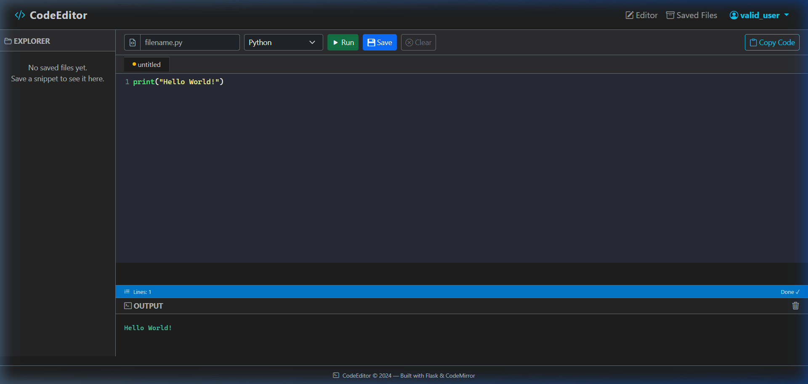
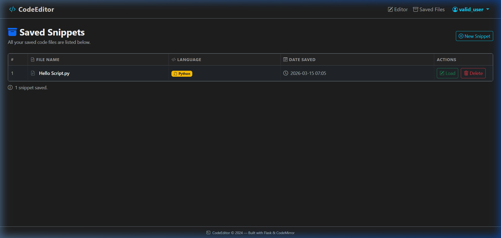
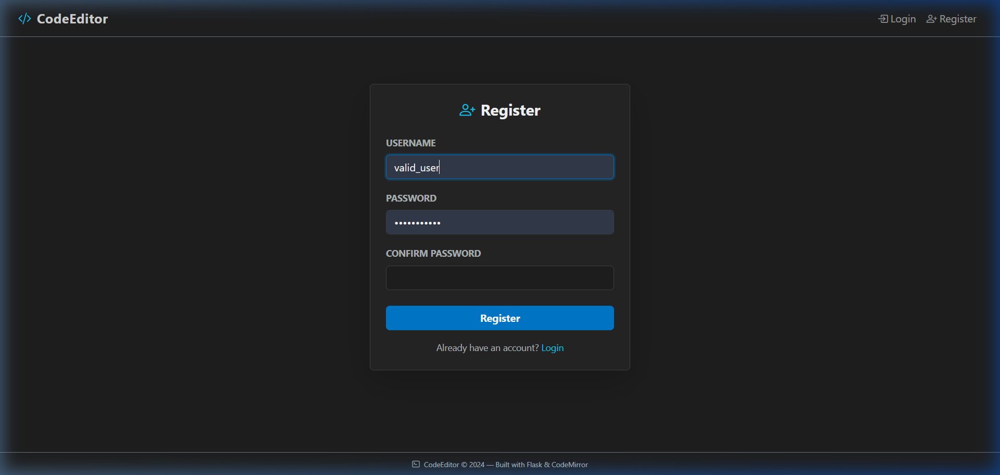
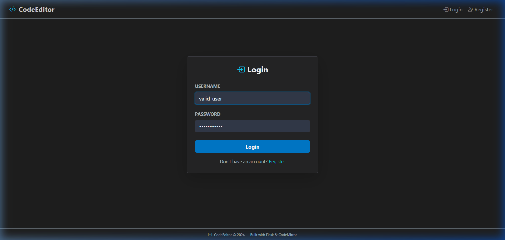

#  CodeEditor — Browser-Based VS Code Clone

A fully functional, browser-based code editor built with **Flask** and **CodeMirror 5**, modelled after the VS Code interface. Write, run (Python), and save code snippets directly in your browser.

---

## 📸 Screenshots

| Editor (3-Panel Layout) | Saved Snippets Page |
|---|---|
|  |  |

---

## 🔑 Demo Account
To test the application quickly, you can use these test credentials:
- **Username**: `valid_user`
- **Password**: `password123`

---

## 📝 Step-by-Step Usage Guide

### 1. Register an Account
Create a new account to get your own private space for saving code snippets.


### 2. Log In
Log in with your newly created credentials.


### 3. Write and Run Code
Use the CodeMirror editor to write Python code and click **Run** to see the output in the terminal below.


### 4. Save and Manage Snippets
Save your code, and access all your saved snippets from the "Saved Files" dashboard.


---

##  Technologies Used

| Layer | Technology |
|---|---|
| Backend | Python · Flask 3.0 |
| Database | SQLite · Flask-SQLAlchemy 3.1 |
| Templating | Jinja2 |
| Frontend | HTML5 (semantic) · Bootstrap 5 (dark) |
| Interactivity | JavaScript · jQuery 3.7 |
| Code Editor | CodeMirror 5 (Dracula theme) |
| Code Execution | Python `subprocess` module |

---

##  Features

- **User Authentication** — Secure login and registration with password hashing.
- **Multi-Language Execution** — Executes **Python** and **JavaScript (Node.js)** code.
- **Web Live Preview** — Renders **HTML/CSS** code in a live preview pane.
- **VS Code-style 3-panel layout** — sidebar, editor, output terminal/preview.
- **CodeMirror 5 editor** — syntax highlighting for all supported languages, Dracula dark theme.
- **Auto-Extension handling** — updates filename extension automatically when changing language.
- **Save & Load snippets** — private user-specific storage for all code files.
- **New File flow** — clear button resets session and URL for fresh starts.
- **Bootstrap dark UI** — premium, responsive, and mobile-friendly design.

---

##  Setup & Deployment

### Local Development
1. **Clone & Install**:
   ```bash
   pip install -r requirements.txt
   ```
2. **Run**:
   ```bash
   python app.py
   ```

### Production Deployment (Render)
This project includes a **Dockerfile** for seamless deployment on Render.
1. Connect your repo to Render as a **Web Service**.
2. Render will automatically build the environment using the Dockerfile (includes Python + Node.js).
3. Set `SECRET_KEY` and (optional) `DATABASE_URL` in environment variables.

---

##  Security & Limits

- **Isolation**: Each user only sees their own files.
- **Limits**: Maximum code size: **5,000 characters**.
- **Timeouts**: Execution is limited to **5 seconds** to prevent infinite loops.
- **Multi-Language**: Backend supports Python and Node.js.
